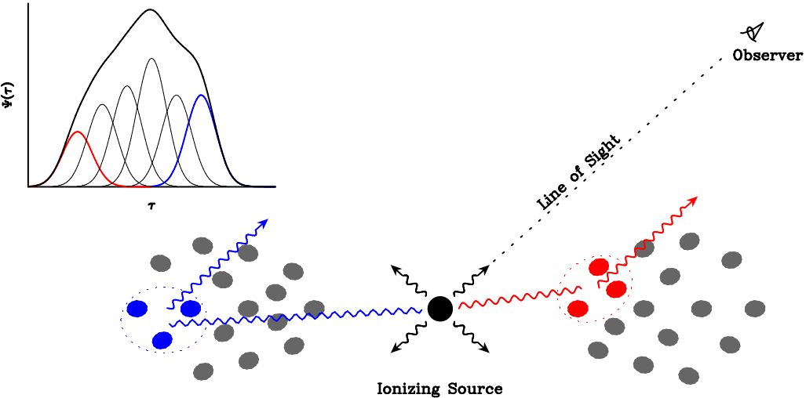

*********************
What is MICA?
*********************
``mica2`` is a non-parameteric approach to analyze light curves in reverberation mapping and infer the transfer functions. 
A transfer function or delay map relates a time series  to its driving time series as

.. math::
  
  L(t) = \int \Psi(\tau) C(t-\tau) d\tau.

``mica2`` expresses the transfer function into a family of displaced Gaussians,

.. math::

  \Psi(\tau) = \sum_{k=1}^{K} f_k \exp\left[-\frac{(\tau-\tau_k)^2}{2\omega_k^2}\right].

  
  Schematic of the transfer function for a system that consists of discrete clouds.

