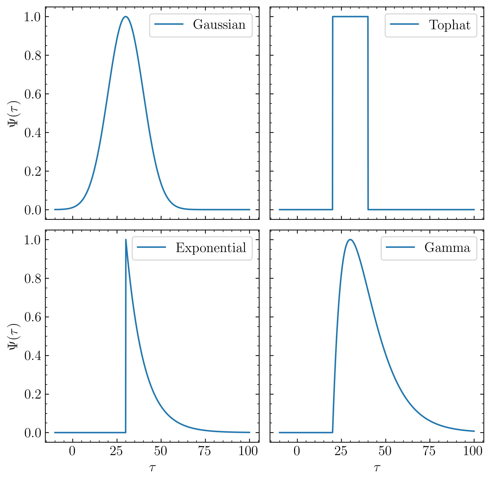

*********************
What is MICA?
*********************
``MICA`` stands for Multiple and Inhomogeneous Component Analysis. It is a non-parametric approach to analyze light curves in reverberation mapping and infer the 
transfer functions and time delays. 

A transfer function or delay map relates a time series  to its driving time series as

.. math::
  
  L(t) = \int \Psi(\tau) C(t-\tau) d\tau.

``mica2`` expresses the transfer function into a family of displaced Gaussians,

.. math::

  \Psi(\tau) = \sum_{k=1}^{K} \frac{f_k}{\sqrt{2\pi}\omega_k} \exp\left[-\frac{(\tau-\tau_k)^2}{2\omega_k^2}\right].

.. note::
  There is a factor :math:`1/\sqrt{2\pi}\omega_k` before the exponential 
  in the above transfer function, therefore, :math:`f_k` represents the 
  response amplitide.

  
  Schematic of the transfer function for a system that consists of discrete clouds.

As alternative options, ``mica2`` also supports several types of transfer functions 

- Top-hat transfer function.

  .. math::

    \Psi(\tau) = \sum_{k=1}^{K} \frac{f_k}{2\omega_k} H(\tau, \tau_k, \omega_k),

  where :math:`H(\tau, \tau_k, \omega_k)` is the top-hat function

  .. math:: 

    H(\tau, \tau_k, \omega_k) =~1~{if}~\tau_k-\omega_k \leqslant \tau \leqslant \tau_k + \omega_k

                              =~0~else~~~~~~~~~~~~~~~~~~~~~~~~~~~~~~~~~~~~

- Gamma transfer function.
  
  .. math::

    \Psi(\tau) = \sum_{k=1}^{K} \frac{f_k}{\omega_k^2} (\tau-\tau_{k}) \exp\left[-\frac{(\tau-\tau_{k})}{\omega_k}\right].
  
  For :math:`k`-th component, the transfer function is zero if :math:`\tau < \tau_{k}`, the peak location 
  is :math:`\tau_k+\omega_k` and the centroid lag is :math:`\tau_k+2\omega_k`.

- Exponential transfer function.

  .. math::

    \Psi(\tau) = \sum_{k=1}^{K} \frac{f_k}{\omega_k} \exp\left[-\frac{(\tau-\tau_{k})}{\omega_k}\right].
  
  For :math:`k`-th component, the transfer function is zero if :math:`\tau < \tau_{k}`, the peak location is :math:`\tau_k`,
  and the centriod lag is :math:`\tau_k+\omega_k`.

  Different shapes of transfer funcitons in MICA.

Here is an example for reverberation mapping analysis of the light curves from Hu et al. (2020) using **MICA**,

  Reverberation mapping analysis of the light curve data for PG 2130+099 (Hu et al. 2020, ApJ, 890, 71).
  The left panel shows transfer functions and the right panel shows the light curves and their reconstructions.

