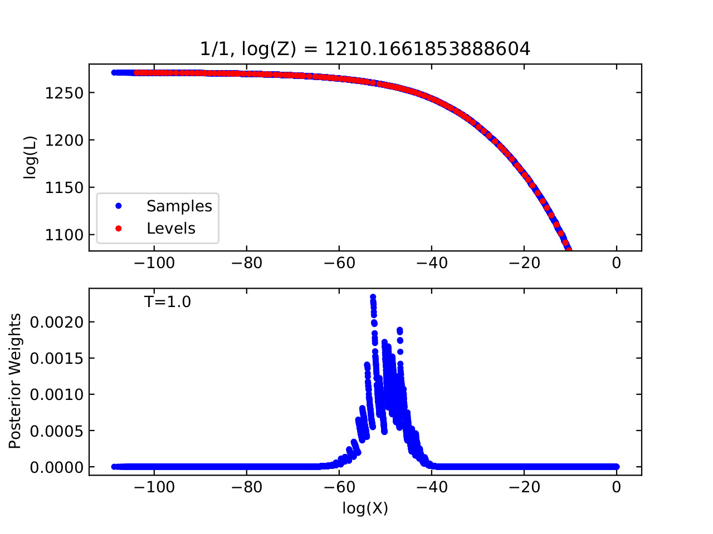
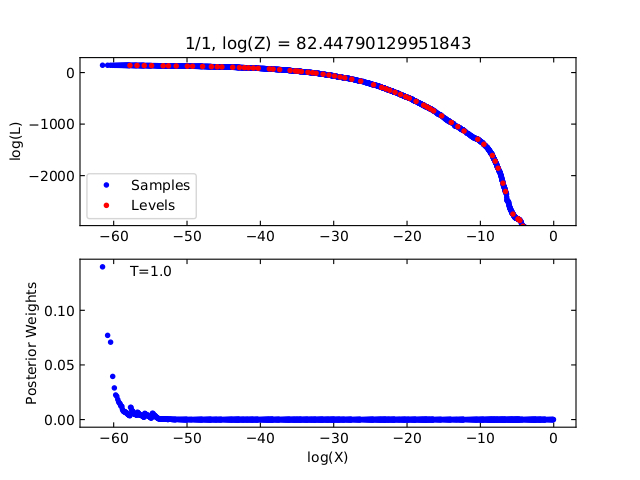

.. _cdnest_label:

*************************
Diffusive Nested Sampling
*************************

``mica2`` employs the diffusive nested sampling technique  to explore the posterior probability distribution, 
which was developed by Brewer et al. (2009). We wrote a C version of the code DNest developed by Brewer et al.
and made some modification for our purpose, available at https://github.com/LiyrAstroph/CDNest. ``mica2`` has 
incorporated CDNEST so that there is no need to install it when using ``mica2``.

To initiate the sampling, we need to input options that control the sampling configurations. 
There are two ways to do so. If one is not familiar with the options, just use the default options.

The first way is directly editing the following lines in the parameter file::

  #==================================================================
  # options for cdnest sampling
  # use the default values or do not turn thme on IF NOT familiar with them
  
  # PTol                     0.1             # likelihood tolerance in loge
  # NumberParticles          1               # number of particles
  # NewLevelIntervalFactor   2               # new level interval
  # SaveIntervalFactor       2               # particular saving interval
  # ThreadStepsFactor        10              # thread steps before communications between cores
  # MaxNumberLevels          0               # maximum number of levels; unlimited for 0
  # BacktrackingLength       10.0            # backforward tracking length (lambda)
  # StrengthEqualPush        100.0           # strength to force equal push (beta)
  
  #===================================================================

In this way, ``mica2`` will output the options to a file named **OPTIONS1D** in the subfolder **param/**.

In generic, the most import options are the likelihood tolerance in loge (PTol) and the maximum number of saves 
(MaxNumberSaves). Unfornatuately, there is not yet a satisfactory rule to determine the best values for these options 
before running the code. If one finds the results not good or the effective sample two few, increase the maximum number of saves.
If this does not work, then decrease PTol option.

The other way is to input an option file in the terminal command as follows.
This option file should look like::

  # File containing parameters for DNest
  # Put comments at the top, or at the end of the line.
  # Do not change the order of lines.
  # Lines beginning with '#' are regarded as comments.
  
  NumberParticles           2	     # Number of particles
  NewLevelIntervalFactor    2	     # New level interval
  ThreadStepsFactor         2      # Thread steps before communications between cores 
  MaxNumberSaves            10000	 # Maximum number of saves
  PTol                      0.1    # Likelihood tolerance in loge
  
  # Full options are:
  # NumberParticles          2
  # NewLevelIntervalFactor   2
  # SaveIntervalFactor       2
  # ThreadStepsFactor        2
  # MaxNumberLevels          0
  # BacktrackingLength       10.0
  # StrengthEqualPush        100.0
  # MaxNumberSaves           10000
  # PTol                     0.1

With this OPTIONS file, run with the command 

.. code:: bash

  mpiexec -n np ./mica2 param/parm param/OPTIONS1D

where ``OPTIONS1D`` is the name of the OPTIONS file, stored in the directory ``param/``.  Note that if there 
is no OPTIONS file input, ``mica2`` will use the default options and create the file ``OPTIONS1D`` in 
the directory ``param/`` (the first way). An example OPTIONS file
can be find in the directory ``param`` in the package.

After MICA2 running finishes, one can run the Python script "postprocess.py" provided in the package as

.. code:: python

  python postprocess.py param/param

This will generate a PDF file **dnest_xx.pdf** in subdirectory **data/** that can be used to diagnose the 
whether option settings are appropriate. The file shows plots like 

  (Top) the likelihood (:math:`\log L`) and (bottom) posterior weigth (:math:`L\Delta X`) as 
  a function of prior mass :math:`X`. **For a good run, there should appear a peak in the 
  bottom panel** (see also the documentation of DNest3, https://github.com/eggplantbren/DNest3).

  **An example for a bad run: there is no peak in the bottom panel.**