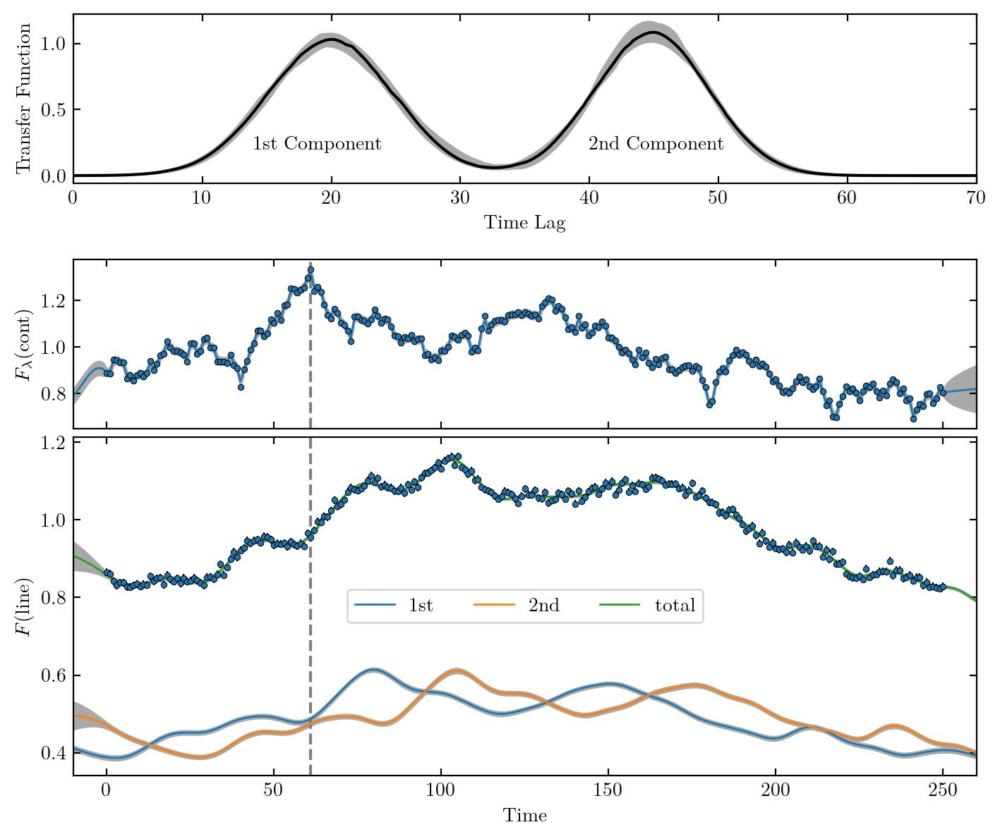

************************
Decomposing Light Curves
************************

``mica2`` can decompose the echoing light curve into components corresponding to each Gaussian component in the transfer function, 
via supplying an option "-d", 

.. code:: bash

   mpiexec -n np ./mica2 param/param -d

The results are output to files named as "data/pline.txt_xx_comp1", where "xx" is the number of Gaussians and "comp1" means 
the first Gaussian component.

  
  (Top) The  transfer function with two Gaussians. (Center) Continuum light
  curve. (Bottom) Emission line light curve and its decomposition into two 
  components according to the two-component transfer function.