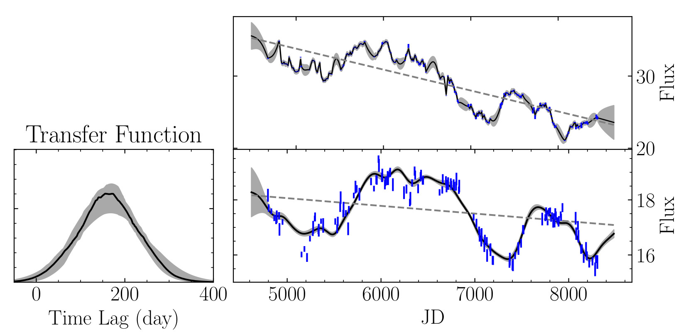

************************
Detrending Light Curves
************************
In some cases, there may appear non-echoed long-term trends in light curves. ``mica2`` can account for those non-echoed 
trends by using a polynomial to do detrending. The order of the polynomial is specified in the parameter file via::
  
  FlagLongtermTrend         0                # Longterm trend in light curves, use a polynomial to fit 
                                             # input the order of the polynomial, e.g.,
                                             # 0, constant  (default)
                                             # 1, linear line 
                                             # 2, conic line
                                             # Use the default if you do not know this.

The default is using a constant and if there are visible non-echoed trends, usually a line polynomial is sufficient.
``mica2`` outputs the values of the polynomial coefficients in a file ``data/trend.txt_xx``, in which two columns 
represent the best value and its uncertainties. The orders of rows in this file are: first the polynomial coefficients for 
the continuum, followed by those for lines. Then there is a blank row and goes for next dataset.
With these values, the polynomial can be expressed as 

.. math::
  
  f = \sum_i a_i t_i,

where :math:`a_i` is the coefficient and :math:`t_i` is the time node of the light curve data.
Below see an example for detrending light curves of 3C 273 from Zhang et al. (2019, ApJ, 876, 49).

  Time lag analysis of light curves of 3C 273 with long-term detrending (``FlagLongtermTrend=1``). Dashed 
  lines represent the long-term trends. 