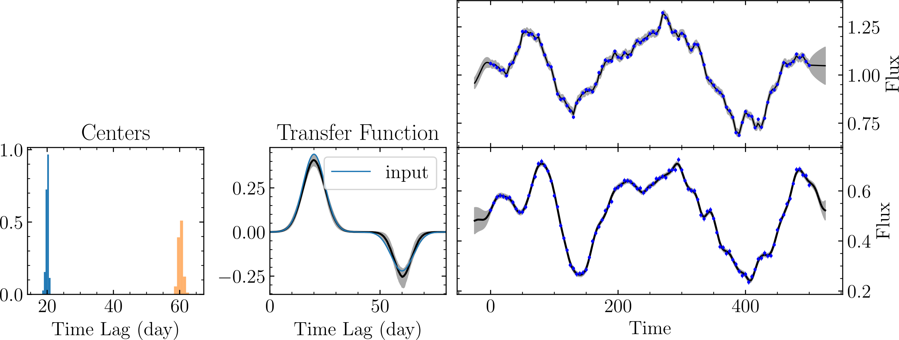

.. _nega_resp_label:

******************
Negative Responses
******************

`mica2` supports negative response through switching on the parameter **FlagNegativeResp**. Here, negative response
means that the amplitudes of the transfer function can be negative. In the `tests/` directory, the subdirectory 
`negative_resp` provides an example as to the usage.

In the example, the input transfer function is 

.. math:: 
  
  \Psi(\tau) \propto \exp\left[-\frac{1}{2}\frac{(\tau-20)^2}{5^2}\right]
              -\frac{1}{2}\exp\left[-\frac{1}{2}\frac{(\tau-60)^2}{5^2}\right].

The obtained results is as follows.

  An example for negative response.