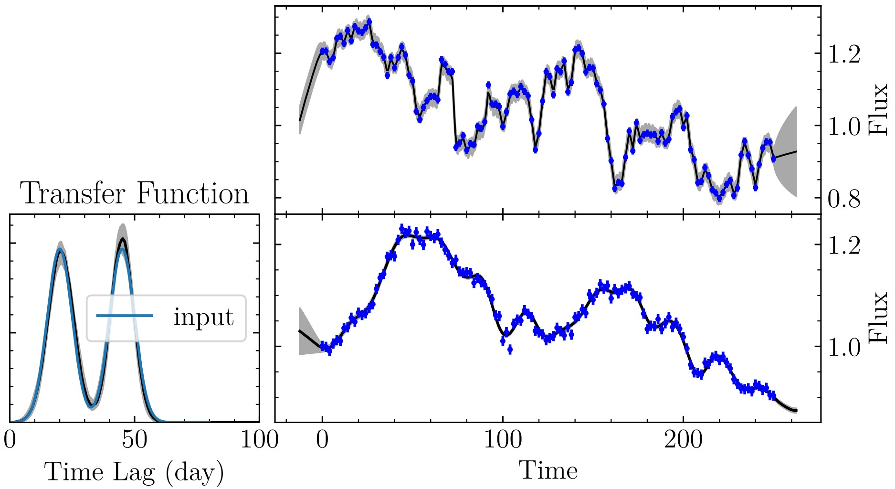
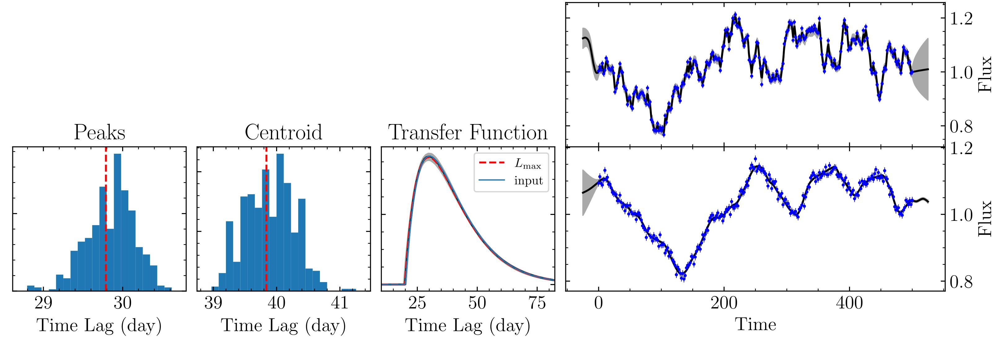
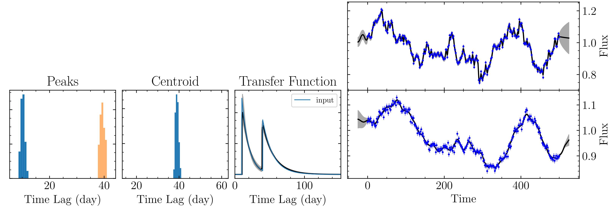
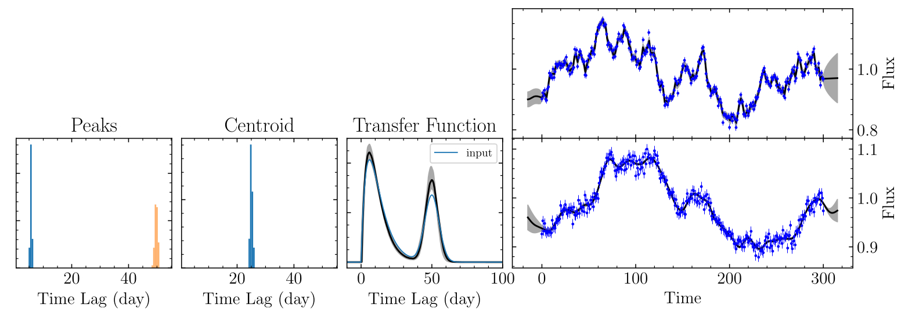

.. _tests_label:

*****
Tests
*****

Make sure that your MICA compiling is successful. After that, change to the subdirectory ``tests``.
There are a suite of tests provided

  - ``python``: a python example
  - ``twogauss``: the transfer function consists of two Gaussians
  - ``twotophat``: the transfer function consists of two top-hat
  - ``gamma``: the transfer function is gamma type
  - ``exp``: the transfer function is exponential type
  - ``pmap``: photometric reverberation mapping
  - ``vmap``: virtual reverberation mapping
  - ``mmap``: reverberation mapping with a mixture of transfer function types 
  - ``negative_resp``: the transfer function can be negative
  - ``restart``: resume from a last run

Change to any one folder and run the test to get familar with the useage of MICA. 

I. python
-----------
This test provides an example for the useage in Python. Run the Python script as 

.. code:: bash 

  mpiexe -n 6 python example.py

Here 6 cores are used. If one wants to use other number of cores, change the number accordingly.

This test is indeed same with the twogauss test below.

II. twogauss/twotophat
----------------------
These two tests use the executable binary version ``mica``. A shell script is provided to run the code and plot the results.
Run the shell script as 

.. code:: bash 

    ./test_twogauss.sh 

or 

.. code:: bash

    ./test_twotophat.sh

The script will create folders ``data`` and ``param``, place appropriate files in the two folders, copy 
the executable file ``mica2`` and ploting script ``plotfig.py``, and then run ``mica2`` and plot the results.

Here is the output for the twogauss tests.

  Results using two Gaussians. (Left) transfer functions; (Right) Fits to light curves.

The obtained evidences are::

    # number_of_gaussians     ln(evidence)
    1       673.680528
    2       814.866840

It is clear that the case of two Gaussians are decisively perferred over the case of one Gaussian. 
The obtained transfer function is remarkably consistent with the input.

.. note::

    MICA does not take into account **a constant normalization factor** for the likelihood function,
    so the obtained Bayesian evidence might be larger than 1. In this case, only the differences in 
    evidence make sense.

III. gamma
---------- 

The transfer function is a gamma function (k=2). Run the Python script as 

.. code:: bash 

  mpiexe -n 6 python example.py

Here 6 cores are used. If one wants to use other number of cores, change the number accordingly.

The output plot looks like 

  The results for a test with gamma transfer function.

IV. exp
-------

The transfer function consists of two exponential functions. Run the Python script as 

.. code:: bash 

  mpiexe -n 6 python example.py

Here 6 cores are used. If one wants to use other number of cores, change the number accordingly.

The output plot looks like 

  The results for a test with exponential transfer function.

V. pmap 
-------

Please refer to :ref:`prm_label` to see the detail.

VI. vmap
---------

Please refer to :ref:`vrm_label` to see the detail.

VII. mmap
---------

The transfer function consists of two different types of basic functions. 
MICA2 supports an abitrary number of components. Here two components are used for 
illustration purpose. Run the Python script as 

.. code:: bash 

  mpiexe -n 6 python example.py

Here 6 cores are used. If one wants to use other number of cores, change the number accordingly.

The output plot looks like 

  The results for a test with a mixture of Gamma and Gaussian transfer functions.

VIII. negative_resp
-------------------

Please refer to :ref:`nega_resp_label` to see the detail.