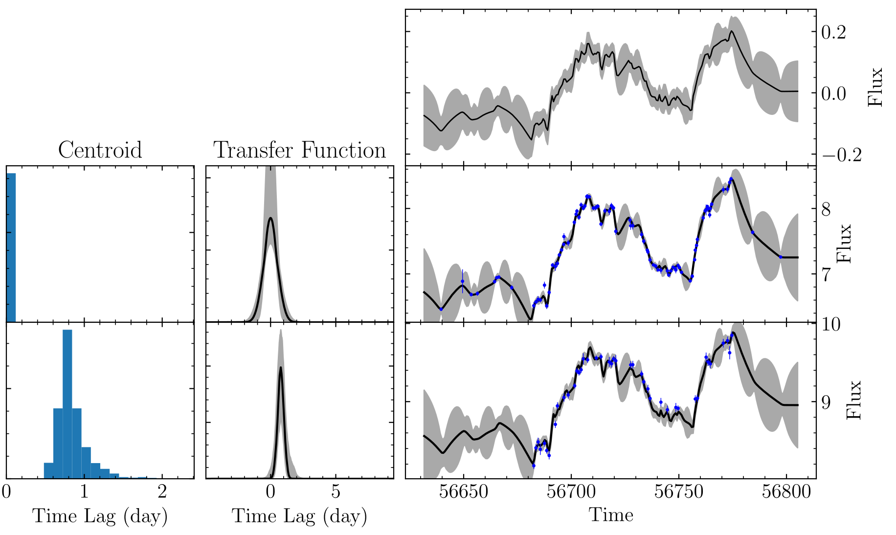

*********************************
Virtual Reverberation Mapping
*********************************
``mica2`` provides a ``vmap`` mode to do reverberation mapping analysis with a virtual driving light curve. This mode applies 
in cases where the dirving light curve cannot be chosen or the driving light curve has a poor qaulity that is not suitable to act 
as the dirving one.

To this end, ``mica2`` assume the virtual drving light curve follows a DRW process with a variation amplitude (:math:`\sigma`) of 0.1
and has a time lag of zero with respect to the first light curve of the input data. The remaining analysis is trival and 
similar to the normal modes.

The input data should have a format as::

  # 1
  # 0:171:269
  56690.6100           3.4270          0.0640     % lc1, 171 lines
  56691.5400           3.5450          0.0650
  ...
  56864.8600           4.3310          0.0740
  56865.9200           4.7080          0.0780

  56698.3570           2.1900          0.0560     % lc2, 269 lines
  56699.5590           2.2000          0.0580
  ...
  56830.1490           2.3000          0.0650
  56830.4200           2.2900          0.0660

Note the in the second line, the first number is set to 0, meaning that the light curve is virtual and does not have data.

For the exectuable binary version, the typical parameter file looks like::

  #
  # lines starting with "#" are regarded as comments and are neglected
  # if want to turn on the line, remove the beginning "#"
  
  #==============================================================
  
  FileDir                       ./
  DataFile                      data/sim_data.txt
  
  TypeModel                     2            # 0: general model
                                             # 1: pmap, photometric RM
                                             # 2: vmap, use a virtual driving light curve.

  TypeTF                        0            # 0: Gaussian
                                             # 1: Top-hat

  MaxNumberSaves                2000         # number of steps
  FlagUniformVarParams          0            # if each data set has the same variability parameters 
  FlagUniformTranFuns           0            # if each data set has the same tf parameters 
  FlagLongtermTrend             0            # if long-term trending
  
  FlagLagPositivity             0            # if enable tf at positive lags
  NumCompLow                    1 
  NumCompUpp                    1 

  FlagConSysErr                 0
  FlagLineSysErr                0

  TypeLagPrior                  0                # type of lag prior for each Gaussians/tophats.
                                                 # 0,  limit0 < lag0 < lag1 < lag2 <... < limit1
                                                 #
                                                 # 1,  limit0 + 0*width < lag0 < limit0 + 1*width
                                                 #     limit0 + 1*width < lag1 < limit0 + 2*width
                                                 #     ...
                                                 #     width = (limit1 - limit0)/num_comp
                                                 #
                                                 # 2,  lags fixed at specific values, no limit on Guassian sigma/tophat width
                                                 #     lag0 = limit0 + 0*dlag
                                                 #     lag1 = limit0 + 1*dlag
                                                 #     ...
                                                 #     dlag = (limit1 - limit0)/(num_comp-1)
                                                 #     
                                                 # 3,  lags fixed at specific values
                                                 #     Gaussian sigma ranges at (dlag/2, dlag), tophat wdith=dlag/2
                                                 #     lag0 = limit0 + 0*dlag
                                                 #     lag1 = limit0 + 1*dlag
                                                 #     ...
                                                 #     dlag = (limit1 - limit0)/(num_comp-1)
                                                 #     better to set a large  mumber of components
  
  StrLagPrior                   [0:10:10:50]     # valid if TypeLagPrior==4
                                                 # format: [lag1_1:lag1_2:lag2_1:lag2_2...]
                                                 # "LagLimitLow" and "LagLimitUpp" no longer applicable

For python version, ``mica`` provide a module ``vmap`` callable as follows.

.. code-block:: python
  
  from mpi4py import MPI
  import numpy as np
  import pymica
  import matplotlib.pyplot as plt
  
  # initiate MPI
  comm = MPI.COMM_WORLD
  rank = comm.Get_rank()

  # load data
  if rank == 0:
    lc0 = np.empty(0)  # virtual light curve, empty
    lc1 = np.loadtxt("mcg08_g.txt")
    lc2 = np.loadtxt("mcg08_r.txt")
    
    # make a data dict 
    data_input = {"set1":[lc0, lc1, lc2]}
  else:
    data_input = None 
  
  data_input = comm.bcast(data_input, root=0)

  
  #create a model
  #there are two ways
  #1) one way from the param file
  
  #model = pymica.gmodel(param_file="param/param_input")
  
  #2) the ohter way is through the setup function
  
  model = pymica.vmap()
  
  # use Gaussians
  model.setup(data=data_input, type_tf='gaussian', lag_limit=[-2, 5], number_component=[1, 1], max_num_saves=2000)
  
  # or use tophats
  #model.setup(data=data_input, type_tf='tophat', lag_limit=[0, 100], number_component=[1, 1], max_num_saves=2000)
  
  #the full arguments are 
  #model.setup(data_file=None, data=None,
  #            type_tf='gaussian', max_num_saves=2000, 
  #            flag_uniform_var_params=False, flag_uniform_tranfuns=False,
  #            flag_trend=0, flag_lag_posivity=False,
  #            lag_limit=[0, 100], number_component=[1, 1],
  #            width_limit=[0.1, 100],
  #            flag_con_sys_err=False, flag_line_sys_err=False,
  #            type_lag_prior=0, lag_prior=[[0, 50]],
  #            num_particles=2, thread_steps_factor=2, 
  #            new_level_interval_factor=2, save_interval_factor=2,
  #            lam=10, beta=100, ptol=0.1, 
  #            max_num_levels=0)
  
  #run mica
  model.run()
  
  #posterior run, only re-generate posterior samples, do not run MCMC
  # model.post_run()
  
  #do decomposition for the cases of multiple components 
  #model.decompose()
  
  # plot results
  if rank == 0:
    
    model.plot_results() # plot results
    model.post_process()  # generate plots for the properties of MCMC sampling 

Here is an example for vmap analysis. The data is extracted from Fausnaugh et al. 2018, ApJ, 854, 10 
(see also Ma, Q., Wu, X.-B. et al. 2023, arXiv:2303.10362)

  An examplary result of MICA2 analysis with vmap mode. The right topmost panel shows the virtual driving 
  light curve.